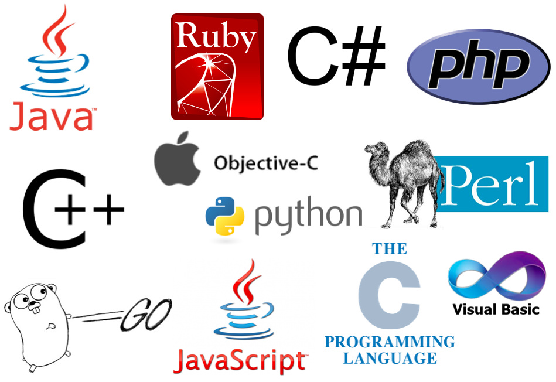

# _Track Suggester_

#### _A quiz to find the right programming language for you, 01,13,2017_

#### By _**Stella Huayhuaca**_

## Description

_This is a quick test to figure out what programming language to study at Epicodus._

## Setup/Installation Requirements

* _To download and install this program, just clone the repository. Something like this:_
     $ git clone https://github.com/uturunku1/track-suggester.git
* _Also you can take the quiz going directly to our site or gh-pages: https://uturunku1.github.io/track-suggester/_

## Support and contact details

_Dear user: if you run into any issues or have questions or suggestion, please feel free to contact me or to make a contribution to the code._

## Technologies Used

_HTML, CSS, Bootstrap and Jquery._

Copyright (c) 2017 **_Stella Huayhuaca_**
